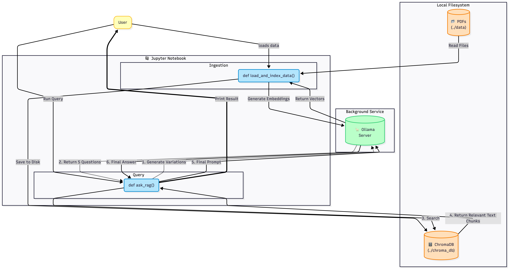

# Minimal RAG (Retrieval-Augmented Generation) Workflow



## Overview

This repository contains a minimal, local RAG demo that shows how to:

- Ingest PDF documents using `PyMuPDF`.
- Split documents into chunks for embeddings using `langchain_text_splitters`.
- Generate embeddings and run a local LLM via `ollama`.
- Store and query embeddings locally with `Chroma`.
- Combine retrieval and generation to answer user questions (QA) using a multi-query retriever and an LLM.

The primary notebook is `rag_workflow.ipynb`, which documents and implements the pipeline end-to-end.

## Architecture

The architecture diagram above (in `architecture/min_rag_arch.png`) shows the high-level components:

- User: interacts with the system (query input).
- RAG Controller (Jupyter/Python): orchestrates ingestion, retrieval, and LLM prompting.
- PDF Documents: local data source used for building the vector store.
- Ollama: local inference server for embeddings and LLM responses.
- ChromaDB: local vector store persisted under `chroma_db/`.

## Files & Structure

- `rag_workflow.ipynb` — Notebook implementing the pipeline with explanatory headings and runnable cells.
- `architecture/min_rag_arch.png` — Architecture diagram used above.
- `chroma_db/` — Persisted Chroma database (created after indexing).
- `data/` — Place your PDF files here for ingestion.

## Quickstart

1. Create and activate a Python virtual environment (recommended Python 3.11/3.12):

```bash
python3 -m venv .venv
source .venv/bin/activate
```

2. Install core dependencies (use the notebook `pip` cells or run manually):

```bash
pip install ollama chromadb pymupdf langchain-text-splitters
pip install -U langchain-ollama langchain-chroma langchain_community
```

3. Start the Ollama server locally and ensure the model you reference (e.g., `llama3`) is available:

```bash
# In a separate terminal
ollama serve
# (Ensure models are downloaded/available locally per Ollama docs)
```

4. Put your PDFs in the `data/` folder and the ingestion cell will index them.

5. Open and run `rag_workflow.ipynb` in JupyterLab / Jupyter Notebook. Run cells sequentially:
   - Setup & connectivity checks
   - Part 1: Ingestion — build or load the Chroma DB
   - Part 2: Retrieval & QA — query the DB with `ask_rag(...)`

## Prerequisites — Ollama setup

Before running the notebook, ensure the Ollama local inference service is installed and a model is available.

1. Install Ollama (macOS):

```bash
# Option A: Homebrew (if you use Homebrew)
brew install ollama

# Option B: Visit the official installer and docs:
# https://ollama.ai/docs
```

2. Start the Ollama service in a separate terminal:

```bash
ollama serve
```

3. Pull a model (example: `llama3`) so it's available locally:

```bash
ollama pull llama3
```

4. Verify the model is ready by running the notebook connectivity cell or by using the Ollama CLI per the documentation. Ensure the model name in the notebook (variable `LLM_MODEL`) matches the pulled model.

Troubleshooting tips:

- Allow sufficient disk space for model downloads (models can be several GBs).
- If the server fails to start, check logs in the terminal where `ollama serve` ran and verify any port/firewall settings.
- See Ollama docs for platform-specific installers or troubleshooting: https://ollama.ai/docs

## Key Notebook Highlights

- `load_and_index_data(folder_path)`:
  - Loads PDFs from `./data` using `PyMuPDFLoader`.
  - Splits text with `RecursiveCharacterTextSplitter`.
  - Creates a `Chroma` DB with `OllamaEmbeddings` and persists to `./chroma_db`.

- `ask_rag(question, vector_db)`:
  - Uses a small prompt that generates multiple query variants (Multi-Query Retriever).
  - Retrieves relevant chunks and sends the context + question to `ChatOllama`.
  - Returns an answer constrained to the retrieved context (QA = Question Answering).

## Notes & Troubleshooting

- If Ollama isn't reachable, you will see a connectivity error in the notebook. Verify `ollama serve` is running and the model name in the notebook matches an available Ollama model.
- If indexing is slow or consumes too much memory, test with fewer PDFs or reduce `chunk_size` in the splitter.
- To improve answer precision, tune the prompt template and retrieval options (e.g., increase `k` or change the retriever settings).
